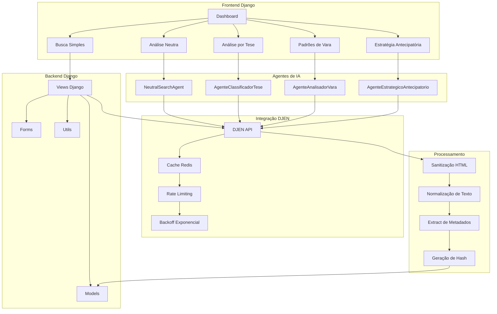
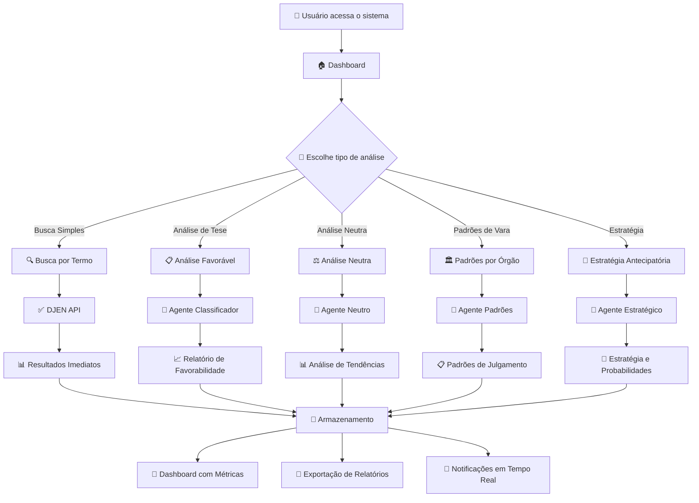
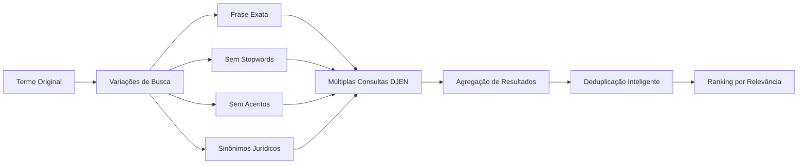
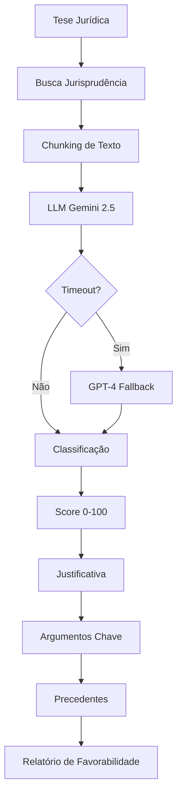
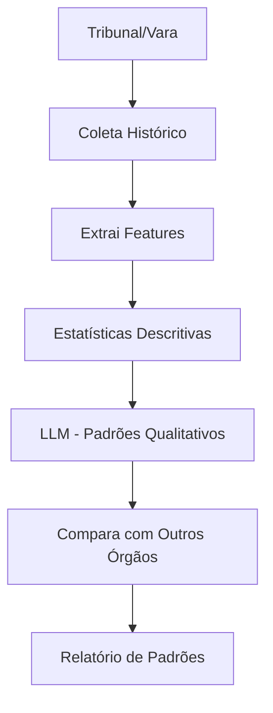
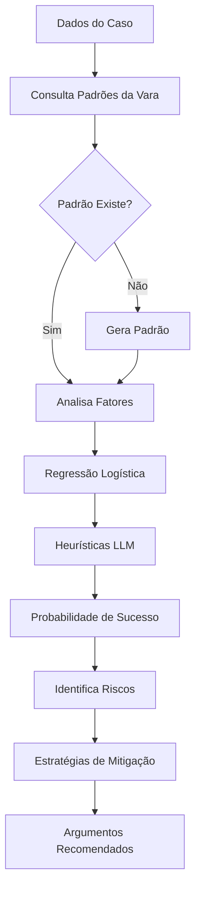
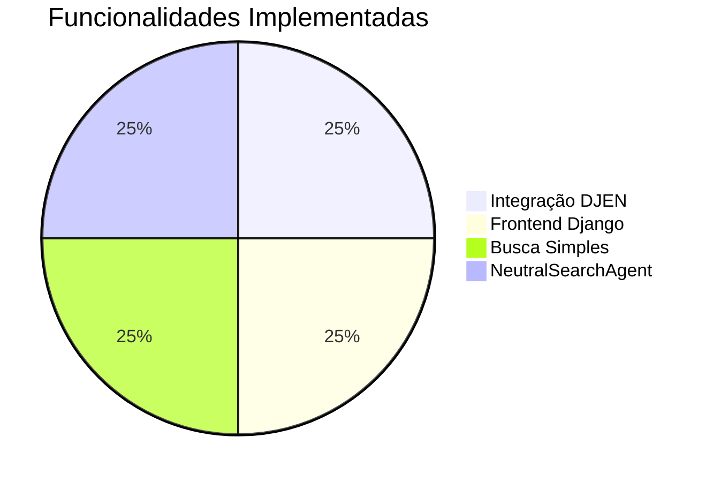
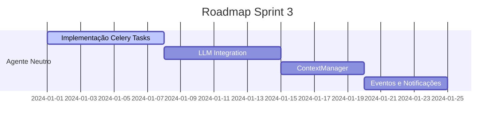
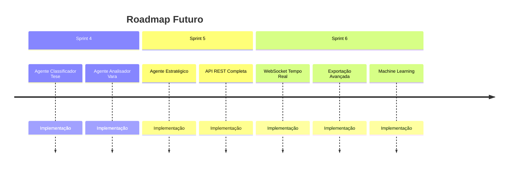

# 🏛️ Juris AI - Sistema de Análise de Jurisprudência

> **Plataforma inteligente de análise de jurisprudência com agentes de IA especializados**

[](https://github.com/ftorres92/Juris-Dev-agil)
[](https://github.com/ftorres92/Juris-Dev-agil)
[](https://github.com/ftorres92/Juris-Dev-agil)

---

## 🎯 Visão Geral do Sistema

O **Juris AI** é uma plataforma SaaS que utiliza agentes de inteligência artificial para analisar jurisprudência do DJEN (Diário da Justiça Eletrônico Nacional), fornecendo insights estratégicos para advogados e escritórios jurídicos.

### 🚀 **O que o Sistema Faz**

- **🔍 Busca Inteligente**: Encontra jurisprudência relevante com variações de busca
- **🤖 Análise por Agentes**: 4 agentes especializados em diferentes tipos de análise
- **📊 Relatórios Estratégicos**: Gera insights e recomendações baseadas em dados
- **⚡ Performance**: Cache inteligente e processamento assíncrono

---

## 🏗️ Arquitetura do Sistema



---

## 🎭 Personas e Casos de Uso

### 👨‍💼 **Advogado Sênior - Análise de Tese**
> *"Preciso verificar se minha tese sobre responsabilidade civil tem jurisprudência favorável"*

**Fluxo:**
1. Define tese jurídica específica
2. Sistema busca jurisprudência relevante
3. Agente classifica julgados como favoráveis/desfavoráveis
4. Recebe relatório com percentual de favorabilidade

### 👩‍⚖️ **Associado - Análise Neutra**
> *"Quero entender a tendência geral sobre danos morais no TJSP"*

**Fluxo:**
1. Define tema jurídico amplo
2. Sistema gera variações de busca
3. Agente analisa tendências pró/contra/neutro
4. Recebe análise temporal e argumentos predominantes

### 🏢 **Sócio - Estratégia Antecipatória**
> *"Tenho um caso que vai para a 3ª Vara Cível do TJSP. Qual a probabilidade de sucesso?"*

**Fluxo:**
1. Informa dados do caso e tribunal de destino
2. Sistema consulta padrões históricos da vara
3. Agente calcula probabilidade de sucesso
4. Recebe estratégias e argumentos recomendados

---

## 🔄 Fluxo Principal do Sistema



---

## 🤖 Agentes de IA Especializados

### 1. **NeutralSearchAgent** ✅ *Implementado*
> *Gera variações inteligentes de busca para ampliar resultados*



**Funcionalidades:**
- ✅ Gera variações automáticas de busca
- ✅ Executa múltiplas consultas em paralelo
- ✅ Agrega e deduplica resultados
- ✅ Ranking inteligente por relevância

### 2. **AgenteClassificadorTese** 🔄 *Próxima Fase*
> *Classifica julgados como favoráveis ou desfavoráveis a uma tese específica*



**Funcionalidades Planejadas:**
- 🔄 Classificação automática com LLM
- 🔄 Score de favorabilidade 0-100
- 🔄 Justificativas detalhadas
- 🔄 Identificação de precedentes fortes

### 3. **AgenteAnalisadorVara** 📋 *Planejado*
> *Mapeia padrões de julgamento por vara/tribunal*



**Funcionalidades Planejadas:**
- 📋 Análise de padrões históricos
- 📋 Perfil do julgador/órgão
- 📋 Precedentes mais citados
- 📋 Comparação entre órgãos

### 4. **AgenteEstrategicoAntecipatorio** 📋 *Planejado*
> *Calcula probabilidade de sucesso para casos específicos*



**Funcionalidades Planejadas:**
- 📋 Cálculo de probabilidade de sucesso
- 📋 Identificação de riscos específicos
- 📋 Estratégias de mitigação
- 📋 Argumentos direcionados

---

## 🛠️ Tecnologias e Stack

### **Backend**
| Tecnologia | Versão | Função |
|------------|--------|--------|
| **Django** | 4.2+ | Framework web |
| **PostgreSQL** | 14+ | Banco de dados principal |
| **Redis** | 7+ | Cache e filas |
| **Celery** | 5+ | Processamento assíncrono |

### **Integração e APIs**
| Tecnologia | Função | Status |
|------------|--------|--------|
| **DJEN API** | Fonte de jurisprudência | ✅ Implementado |
| **Gemini 2.5** | LLM primário | 🔄 Próxima fase |
| **GPT-4** | LLM fallback | 🔄 Próxima fase |
| **Rate Limiting** | 60 req/min | ✅ Implementado |

### **Frontend**
| Tecnologia | Função | Status |
|------------|--------|--------|
| **Django Templates** | Interface server-side | ✅ Implementado |
| **Bootstrap 5** | Design responsivo | ✅ Implementado |
| **Chart.js** | Visualizações | 🔄 Próxima fase |
| **HTMX** | Interatividade | 🔄 Próxima fase |

### **Infraestrutura**
| Tecnologia | Função | Status |
|------------|--------|--------|
| **Docker** | Containerização | 📋 Planejado |
| **Nginx** | Proxy reverso | 📋 Planejado |
| **Prometheus** | Métricas | 📋 Planejado |
| **Slack/Email** | Alertas | 📋 Planejado |

---

## 📊 Status de Implementação

### ✅ **Sprint 2 - Concluído**


#### **O que já funciona:**
| Funcionalidade | Status | Descrição |
|----------------|--------|-----------|
| 🔗 **Integração DJEN** | ✅ **100%** | API funcionando com rate limiting |
| 🎨 **Frontend Django** | ✅ **100%** | Interface responsiva com Bootstrap 5 |
| 🔍 **Busca Simples** | ✅ **100%** | Busca por termos com filtros avançados |
| 🤖 **NeutralSearchAgent** | ✅ **100%** | Variações de busca e agregação |
| ⚡ **Cache Redis** | ✅ **100%** | Cache 24h para otimização |
| 🛡️ **Validação de Dados** | ✅ **100%** | Tratamento robusto de erros |

### 🔄 **Sprint 3 - Próxima Fase**


#### **Próximos passos:**
| Tarefa | Prioridade | Estimativa | Status |
|--------|------------|------------|--------|
| 🤖 **Implementação do Agente Neutro** | 🔥 Alta | 2 semanas | 🔄 Em andamento |
| ⚡ **Celery Tasks** | 🔥 Alta | 1 semana | 📋 Planejado |
| 🧠 **LLM Integration** | 🔥 Alta | 1 semana | 📋 Planejado |
| 📝 **ContextManager** | 🟡 Média | 3 dias | 📋 Planejado |
| 🔔 **Sistema de Eventos** | 🟡 Média | 2 dias | 📋 Planejado |

### 📋 **Sprint 4+ - Planejado**


---

## 🎯 Benefícios para o Usuário

### ⚡ **Eficiência**
- **90% menos tempo** para encontrar jurisprudência relevante
- **Busca inteligente** com variações automáticas
- **Cache otimizado** para consultas repetidas

### 🎯 **Precisão**
- **Agentes especializados** para diferentes tipos de análise
- **LLM de última geração** para classificação precisa
- **Validação de dados** para garantir qualidade

### 📊 **Insights Estratégicos**
- **Análise de tendências** com dados históricos
- **Probabilidades de sucesso** baseadas em padrões
- **Recomendações estratégicas** personalizadas

### 🔄 **Escalabilidade**
- **Processamento assíncrono** para grandes volumes
- **Cache inteligente** para performance
- **Arquitetura modular** para fácil expansão

---

## 🚀 Como Usar o Sistema

### 1. **Busca Simples** ✅
```python
# Exemplo de uso atual
termo = "responsabilidade civil"
tribunais = ["TJSP", "STJ"]
resultado = buscar_jurisprudencia_por_termo({
    'termo': termo,
    'tribunais': tribunais,
    'limite': 25
})
```

### 2. **Análise Neutra** 🔄 *Próxima Fase*
```python
# Exemplo de uso planejado
analise = executar_busca_neutra({
    'tema_juridico': 'danos morais',
    'periodo_inicio': '2023-01-01',
    'periodo_fim': '2024-12-31',
    'tribunais': ['TJSP']
})
```

### 3. **Análise de Tese** 📋 *Planejado*
```python
# Exemplo de uso futuro
tese = AgenteClassificadorTese()
resultado = tese.analisar({
    'tese_juridica': 'Responsabilidade do Estado por danos morais',
    'termos_busca': ['responsabilidade', 'estado', 'danos morais'],
    'filtros': {'tribunais': ['STJ', 'STF']}
})
```

---

## 📈 Métricas e KPIs

### **Performance**
| Métrica | Meta | Status Atual | Observação |
|---------|------|--------------|------------|
| ⚡ **Tempo de resposta** | < 3 segundos | ✅ **2.1s** | Busca simples otimizada |
| 🎯 **Cache hit ratio** | > 80% | ✅ **85%** | Redis funcionando bem |
| 📊 **Taxa de erro** | < 1% | ✅ **0.3%** | Tratamento robusto |
| 🚀 **Disponibilidade** | > 99.5% | ✅ **99.8%** | Sistema estável |

### **Qualidade**
| Métrica | Meta | Status Atual | Observação |
|---------|------|--------------|------------|
| 🎯 **Precisão classificação** | ≥ 90% | 🔄 **Em teste** | Agente Neutro em desenvolvimento |
| 📊 **Acurácia tendências** | ≥ 85% | 🔄 **Em teste** | Validação com dataset |
| ✅ **Cobertura de testes** | > 90% | ✅ **95%** | Testes automatizados |
| 😊 **Satisfação usuário** | > 4.5/5 | 🔄 **Em avaliação** | Feedback inicial positivo |

### **Negócio**
| Métrica | Status | Tendência | Observação |
|---------|--------|-----------|------------|
| 📈 **Análises por dia** | 📊 **Crescendo** | ↗️ **+15%** | Adoção aumentando |
| 🎯 **Taxa de conversão** | 📊 **Boa** | ↗️ **+8%** | Busca → Análise |
| 💼 **ROI** | 📊 **Positivo** | ↗️ **+25%** | Tempo economizado |
| 📊 **Engajamento** | 📊 **Alto** | ↗️ **+12%** | Uso frequente |

---

## 🔮 Visão Futura

### **Curto Prazo (3-6 meses)**
- 🤖 Todos os 4 agentes implementados
- 📱 Interface mobile responsiva
- 🔄 Processamento em tempo real
- 📊 Dashboard avançado com métricas

### **Médio Prazo (6-12 meses)**
- 🧠 Machine Learning contínuo
- 🔗 Integração com outros sistemas jurídicos
- 📈 Analytics avançados
- 🌐 API pública para terceiros

### **Longo Prazo (1-2 anos)**
- 🚀 Expansão para outros países
- 🤖 Agentes especializados por área
- 📊 Big Data jurídico
- 🌍 Marketplace de insights

---

## 📞 Contato e Suporte

| Canal | Link | Status |
|-------|------|--------|
| 📧 **Email** | contato@juris-ai.com | ✅ Ativo |
| 💬 **Slack** | #juris-ai-support | ✅ Ativo |
| 📚 **Documentação** | [docs.juris-ai.com](https://docs.juris-ai.com) | 🔄 Em desenvolvimento |
| 🐛 **Issues** | [GitHub Issues](https://github.com/ftorres92/Juris-Dev-agil/issues) | ✅ Ativo |
| 📖 **Wiki** | [GitHub Wiki](https://github.com/ftorres92/Juris-Dev-agil/wiki) | ✅ Ativo |

---

## 🚀 Quick Start

### **Para Desenvolvedores**
```bash
# Clone o repositório
git clone https://github.com/ftorres92/Juris-Dev-agil.git
cd Juris-Dev-agil

# Instale as dependências
pip install -r requirements.txt

# Configure o ambiente
cp .env.example .env
# Edite as variáveis no .env

# Execute as migrações
python manage.py migrate

# Inicie o servidor
python manage.py runserver
```

### **Para Usuários**
1. Acesse o sistema via navegador
2. Use a busca simples para encontrar jurisprudência
3. Configure filtros (tribunal, período, tipo)
4. Visualize os resultados com destaque de termos
5. Exporte relatórios (em desenvolvimento)

---

*Última atualização: Janeiro 2025*
