# Fluxograma da Lógica de Negócio - Sistema Juris AI

## Visão Geral do Sistema

O sistema Juris AI é uma plataforma de análise de jurisprudência que utiliza agentes de IA para processar e analisar julgados do DJEN (Diário da Justiça Eletrônico Nacional). O sistema está organizado em sprints com funcionalidades específicas implementadas e planejadas.

## Arquitetura do Sistema

### **Sprint 2 - Integração DJEN e Frontend (Concluído)**
- ✅ Integração com DJEN API funcionando
- ✅ Frontend Django com Bootstrap 5
- ✅ Busca por termos implementada
- ✅ Validação de dados e tratamento de erros
- ✅ Cache Redis e rate limiting

### **Sprint 3 - Implementação dos Agentes (Em Andamento)**
- 🔄 **Próxima Fase**: Implementação do Agente Neutro
- 📋 **Planejado**: AgenteClassificadorTese
- 📋 **Planejado**: AgenteAnalisadorVara  
- 📋 **Planejado**: AgenteEstrategicoAntecipatorio

## Fluxograma Principal

```mermaid
graph TD
    A[Usuário acessa o sistema] --> B[Dashboard Django]
    B --> C[Escolhe tipo de análise]
    
    C --> D[Análise de Jurisprudência por Tese]
    C --> E[Análise Neutra de Jurisprudência]
    C --> F[Análise de Padrões de Vara/Tribunal]
    C --> G[Estratégia Antecipatória]
    C --> H[Busca Simples DJEN]
    
    %% Fluxo de Análise por Tese (PLANEJADO - Sprint 3+)
    D --> D1[Usuário define tese jurídica]
    D1 --> D2[Define termos de busca]
    D2 --> D3[Configura filtros e período]
    D3 --> D4[🔄 IMPLEMENTAR: Celery Task classificador_tese.run]
    D4 --> D5[🔄 IMPLEMENTAR: Verifica cache Redis]
    D5 --> D6{🔄 IMPLEMENTAR: Cache existe?}
    D6 -->|Sim| D7[🔄 IMPLEMENTAR: Usa dados do cache]
    D6 -->|Não| D8[✅ CONSULTA DJEN API]
    D8 --> D9[✅ Rate limiting 60 req/min]
    D9 --> D10[✅ Backoff exponencial]
    D10 --> D11[✅ Coleta julgados relevantes]
    D11 --> D12[✅ Processamento e sanitização]
    D12 --> D13[🔄 IMPLEMENTAR: Agente IA - Análise de conteúdo]
    D13 --> D14[🔄 IMPLEMENTAR: ContextManager - Chunking ≤6k tokens]
    D14 --> D15[🔄 IMPLEMENTAR: LLM Gemini 2.5 - Classificação]
    D15 --> D16[🔄 IMPLEMENTAR: Fallback GPT-4 se necessário]
    D16 --> D17[🔄 IMPLEMENTAR: Ranking de relevância por IA]
    D17 --> D18[🔄 IMPLEMENTAR: Persiste em JulgadoFavoravel]
    D18 --> D19[🔄 IMPLEMENTAR: Atualiza AnaliseJurisprudenciaTese]
    D19 --> D20[🔄 IMPLEMENTAR: Evento: juris.analise_tese.ready]
    D20 --> D21[🔄 IMPLEMENTAR: Relatório de Favorabilidade]
    
    %% Fluxo de Análise Neutra (PRÓXIMA FASE - Sprint 3)
    E --> E1[Usuário define tema jurídico]
    E1 --> E2[Configura período de análise]
    E2 --> E3[🔄 PRÓXIMA FASE: Celery Task analisador_neutro.run]
    E3 --> E4[🔄 IMPLEMENTAR: NeutralSearchAgent - Variações]
    E4 --> E5[🔄 IMPLEMENTAR: Gera variações de busca]
    E5 --> E6[✅ CONSULTA DJEN API - Múltiplas consultas]
    E6 --> E7[🔄 IMPLEMENTAR: Agrega e deduplica resultados]
    E7 --> E8[✅ Processamento e sanitização]
    E8 --> E9[🔄 IMPLEMENTAR: Agente IA - Análise de conteúdo]
    E9 --> E10[🔄 IMPLEMENTAR: Clusterização TF-IDF + KMeans]
    E10 --> E11[🔄 IMPLEMENTAR: LLM - Análise pró/contra/neutro]
    E11 --> E12[🔄 IMPLEMENTAR: Ranking de relevância por IA]
    E12 --> E13[🔄 IMPLEMENTAR: Identifica tendência majoritária]
    E13 --> E14[🔄 IMPLEMENTAR: Persiste em AnaliseJurisprudenciaNeutra]
    E14 --> E15[🔄 IMPLEMENTAR: Evento: analisador_neutro.completed]
    E15 --> E16[🔄 IMPLEMENTAR: Relatório de Tendências]
    
    %% Fluxo de Padrões de Vara (PLANEJADO - Sprint 3+)
    F --> F1[Seleciona tribunal/vara]
    F1 --> F2[Define tema jurídico]
    F2 --> F3[Configura período]
    F3 --> F4[🔄 IMPLEMENTAR: Celery Task analisador_vara.run]
    F4 --> F5[✅ CONSULTA DJEN API - Coleta julgados históricos]
    F5 --> F6[✅ Processamento e sanitização]
    F6 --> F7[🔄 IMPLEMENTAR: Agente IA - Análise de conteúdo]
    F7 --> F8[🔄 IMPLEMENTAR: Extrai features estruturais]
    F8 --> F9[🔄 IMPLEMENTAR: Estatísticas descritivas]
    F9 --> F10[🔄 IMPLEMENTAR: LLM - Padrões qualitativos]
    F10 --> F11[🔄 IMPLEMENTAR: Fallback GPT-4 se necessário]
    F11 --> F12[🔄 IMPLEMENTAR: Ranking de relevância por IA]
    F12 --> F13[🔄 IMPLEMENTAR: Compara com outros órgãos]
    F13 --> F14[🔄 IMPLEMENTAR: Persiste em PadroesVaraTribunal]
    F14 --> F15[🔄 IMPLEMENTAR: Evento: padrao_vara.updated]
    F15 --> F16[🔄 IMPLEMENTAR: Relatório de Padrões]
    
    %% Fluxo de Estratégia Antecipatória (PLANEJADO - Sprint 3+)
    G --> G1[Informa número do processo]
    G1 --> G2[Define tribunal/vara de destino]
    G2 --> G3[Upload de documentos do caso]
    G3 --> G4[🔄 IMPLEMENTAR: Celery Task estrategico_antecipatorio.run]
    G4 --> G5[🔄 IMPLEMENTAR: Busca PadroesVaraTribunal]
    G5 --> G6{🔄 IMPLEMENTAR: Padrão existe?}
    G6 -->|Não| G7[🔄 IMPLEMENTAR: Dispara analisador_vara.run]
    G6 -->|Sim| G8[🔄 IMPLEMENTAR: Agente IA - Análise de conteúdo]
    G7 --> G8
    G8 --> G9[🔄 IMPLEMENTAR: LLM - Extrai fatores do caso]
    G9 --> G10[🔄 IMPLEMENTAR: Fallback GPT-4 se necessário]
    G10 --> G11[🔄 IMPLEMENTAR: Regressão logística + heurísticas]
    G11 --> G12[🔄 IMPLEMENTAR: Ranking de relevância por IA]
    G12 --> G13[🔄 IMPLEMENTAR: Calcula probabilidade de sucesso]
    G13 --> G14[🔄 IMPLEMENTAR: Identifica riscos específicos]
    G14 --> G15[🔄 IMPLEMENTAR: Gera estratégias de mitigação]
    G15 --> G16[🔄 IMPLEMENTAR: Recomenda argumentos direcionados]
    G16 --> G17[🔄 IMPLEMENTAR: Persiste em EstrategiaAntecipatoria]
    G17 --> G18[🔄 IMPLEMENTAR: Evento: estrategia_antecipatoria.completed]
    G18 --> G19[🔄 IMPLEMENTAR: Relatório Estratégico]
    
    %% Fluxo de Busca Simples (IMPLEMENTADO - Sprint 2)
    H --> H1[✅ Formulário Django aprimorado]
    H1 --> H2[✅ Validação client-side]
    H2 --> H3[✅ DJENCollector.search]
    H3 --> H4[✅ Cache Redis 24h]
    H4 --> H5[✅ Sanitização HTML]
    H5 --> H6[✅ Normalização de texto]
    H6 --> H7[✅ Extract de metadados]
    H7 --> H8[✅ Geração de hash único]
    H8 --> H9[✅ Resultados em tempo real]
    
    %% Integração com DJEN (IMPLEMENTADO) - FONTE DE DADOS
    D8 --> DJEN[DJEN API]
    E6 --> DJEN
    F5 --> DJEN
    H3 --> DJEN
    
    DJEN --> DJEN1[✅ Validação de conectividade]
    DJEN1 --> DJEN2[✅ Rate limiting 60 req/min]
    DJEN2 --> DJEN3[✅ Cache Redis TTL 24h]
    DJEN3 --> DJEN4[✅ Backoff exponencial]
    DJEN4 --> DJEN5[✅ Retry até 3 vezes]
    DJEN5 --> DJEN6[✅ Retorna julgados padronizados]
    
    %% Processamento de Dados (IMPLEMENTADO)
    DJEN6 --> PROC1[✅ Sanitização HTML - html_sanitizer]
    PROC1 --> PROC2[✅ Normalização - search_query]
    PROC2 --> PROC3[✅ Extract de metadados]
    PROC3 --> PROC4[✅ Geração de hash SHA256]
    PROC4 --> PROC5[✅ Validação de integridade]
    PROC5 --> PROC6[✅ Armazenamento no banco]
    
    %% Agentes de IA (STATUS ATUAL) - PROCESSAM DADOS DO DJEN
    PROC6 --> AGENT1[🔄 NeutralSearchAgent - PRÓXIMA FASE]
    PROC6 --> AGENT2[🔄 AgenteClassificadorTese - PLANEJADO]
    PROC6 --> AGENT3[🔄 AgenteAnalisadorVara - PLANEJADO]
    PROC6 --> AGENT4[🔄 AgenteEstrategicoAntecipatorio - PLANEJADO]
    
    %% Context Manager e LLM (PLANEJADO)
    AGENT1 --> CTX1[🔄 IMPLEMENTAR: ContextManager - 12k tokens]
    AGENT2 --> CTX1
    AGENT3 --> CTX1
    AGENT4 --> CTX1
    
    CTX1 --> LLM1[🔄 IMPLEMENTAR: Gemini 2.5 Primary]
    LLM1 --> LLM2{🔄 IMPLEMENTAR: Timeout > 20s?}
    LLM2 -->|Sim| LLM3[🔄 IMPLEMENTAR: GPT-4 Fallback]
    LLM2 -->|Não| LLM4[🔄 IMPLEMENTAR: Processa resultado]
    LLM3 --> LLM4
    
    %% Validação e Qualidade (PARCIALMENTE IMPLEMENTADO)
    LLM4 --> VAL1[✅ Validação de integridade - data_integrity]
    VAL1 --> VAL2[✅ Verificação de duplicatas]
    VAL2 --> VAL3[🔄 IMPLEMENTAR: Validação de scores 0-100]
    VAL3 --> VAL4[🔄 IMPLEMENTAR: Controle de qualidade]
    VAL4 --> VAL5[🔄 IMPLEMENTAR: Logs estruturados JSON]
    VAL5 --> RESULT[✅ Resultados finais]
    
    %% Armazenamento (MODELOS CRIADOS)
    RESULT --> DB[(✅ Banco de Dados)]
    DB --> DB1[✅ Julgado - Base]
    DB --> DB2[✅ AnaliseJurisprudenciaTese - Modelo criado]
    DB --> DB3[✅ AnaliseJurisprudenciaNeutra - Modelo criado]
    DB --> DB4[✅ PadroesVaraTribunal - Modelo criado]
    DB --> DB5[✅ EstrategiaAntecipatoria - Modelo criado]
    DB --> DB6[✅ JulgadoFavoravel - Modelo criado]
    
    %% Eventos e Notificações (PLANEJADO)
    DB2 --> EVT1[🔄 IMPLEMENTAR: Evento: juris.analise_tese.ready]
    DB3 --> EVT2[🔄 IMPLEMENTAR: Evento: analisador_neutro.completed]
    DB4 --> EVT3[🔄 IMPLEMENTAR: Evento: padrao_vara.updated]
    DB5 --> EVT4[🔄 IMPLEMENTAR: Evento: estrategia_antecipatoria.completed]
    
    %% Relatórios e Visualizações (PLANEJADO)
    EVT1 --> REP1[🔄 IMPLEMENTAR: Dashboard - Métricas]
    EVT2 --> REP2[🔄 IMPLEMENTAR: Gráficos Chart.js]
    EVT3 --> REP3[🔄 IMPLEMENTAR: Exportação PDF/DOCX]
    EVT4 --> REP4[🔄 IMPLEMENTAR: WebSocket - Tempo Real]
    
    %% Monitoramento e Observabilidade (PLANEJADO)
    REP1 --> MON1[🔄 IMPLEMENTAR: Logs estruturados - juris.agentes]
    MON1 --> MON2[🔄 IMPLEMENTAR: Métricas Prometheus]
    MON2 --> MON3[🔄 IMPLEMENTAR: Health Checks]
    MON3 --> MON4[🔄 IMPLEMENTAR: Alertas Slack/Email]
    
    %% Feedback e Aprendizado (PLANEJADO)
    REP1 --> FEED1[🔄 IMPLEMENTAR: Usuário avalia resultados]
    REP2 --> FEED1
    REP3 --> FEED1
    REP4 --> FEED1
    
    FEED1 --> ML1[🔄 IMPLEMENTAR: Dataset rotulado para validação]
    ML1 --> ML2[🔄 IMPLEMENTAR: Atualização de modelos]
    ML2 --> ML3[🔄 IMPLEMENTAR: Melhoria de algoritmos]
    ML3 --> ML4[🔄 IMPLEMENTAR: Otimização de buscas]
    ML4 --> AGENT1
```

## Componentes Principais

### 1. **Modelos de Dados Django**
- **Julgado**: Base de julgados coletados do DJEN com hash único
- **AnaliseJurisprudenciaTese**: Análise favorável a uma tese específica
- **AnaliseJurisprudenciaNeutra**: Análise neutra de tendências
- **PadroesVaraTribunal**: Padrões de julgamento por órgão
- **EstrategiaAntecipatoria**: Estratégias para casos específicos
- **JulgadoFavoravel**: Relacionamento entre análises e julgados

### 2. **Agentes de IA Especializados**
- **AgenteClassificadorTese**: Classifica julgados favoráveis/desfavoráveis com LLM
- **AgenteAnalisadorNeutro**: Análise neutra com NeutralSearchAgent
- **AgenteAnalisadorVara**: Mapeia padrões históricos por vara/tribunal
- **AgenteEstrategicoAntecipatorio**: Calcula probabilidade de sucesso

### 3. **Integração DJEN Robusta**
- **DJENCollector**: Interface Python com rate limiting
- **Conectividade**: Teste automatizado de conectividade
- **Rate Limiting**: Controle rigoroso de 60 req/min
- **Cache Redis**: TTL 24h com chaves estruturadas
- **Backoff Exponencial**: Retry inteligente com fallbacks
- **Validação de Dados**: Verificação de integridade completa

### 4. **Processamento de Dados Avançado**
- **html_sanitizer**: Sanitização HTML robusta
- **search_query**: Normalização e parsing de consultas
- **data_integrity**: Validação de integridade de dados
- **validation_integration**: Integração com fallbacks automáticos
- **Geração de Hash SHA256**: Identificação única de conteúdo

### 5. **Sistema de Filas Celery**
- **Filas Dedicadas**: `juris.classificador`, `juris.neutro`, `juris.vara`, `juris.estrategico`
- **ContextManager**: Limitação de 12k tokens por agente
- **Chunking Inteligente**: Divisão em blocos ≤6k tokens
- **Orquestração**: Jobs assíncronos com eventos

### 6. **LLM e Fallbacks**
- **Gemini 2.5**: Modelo primário para todos os agentes
- **GPT-4 Fallback**: Ativação automática em timeout >20s
- **Prompts Especializados**: Templates específicos por agente
- **Gestão de Contexto**: Limitação inteligente de tokens

## Fluxos de Dados Detalhados

### **Entrada do Usuário**
1. **Dashboard Django**: Interface responsiva com Bootstrap 5
2. **Formulários Validados**: Validação client-side e server-side
3. **Seleção de Agentes**: Checkboxes para múltiplos agentes
4. **Configuração de Filtros**: Tribunais, período, tipo de decisão

### **Processamento Assíncrono**
1. **Celery Tasks**: Jobs enfileirados em filas dedicadas
2. **Cache Redis**: Verificação de dados existentes
3. **Consulta DJEN**: Rate limiting e backoff exponencial
4. **Processamento de Dados**: Sanitização e normalização
5. **Agentes de IA**: Análise e classificação de conteúdo
6. **ContextManager**: Chunking e gestão de tokens
7. **LLM Processing**: Gemini 2.5 com fallback GPT-4
8. **Ranking de Relevância**: Ordenação inteligente por IA
9. **Persistência**: Transações atômicas no Django ORM

### **Saída e Eventos**
1. **Eventos Pub/Sub**: `juris.analise_tese.ready`, `analisador_neutro.completed`
2. **Relatórios Estruturados**: JSON com métricas detalhadas
3. **Visualizações**: Chart.js para gráficos interativos
4. **Exportação**: PDF/DOCX com templates customizados
5. **WebSocket**: Atualizações em tempo real

## Tratamento de Erros Robusto

### **Níveis de Fallback**
1. **Cache Redis**: Primeira linha de defesa
2. **DJEN API**: Consulta direta com retry
3. **LLM Fallback**: Gemini → GPT-4 em caso de timeout
4. **Dados Históricos**: Uso de padrões existentes
5. **Mensagens de Erro**: User-friendly com troubleshooting

### **Monitoramento Contínuo**
- **Health Checks**: Verificação automática de componentes
- **Logs Estruturados**: JSON com `job_id` e `tenant_id`
- **Métricas Prometheus**: Latência, tokens, erros
- **Alertas**: Slack/Email para falhas críticas

## Métricas e KPIs

### **Performance**
- **SLA**: 3 minutos por job (p95) com até 500 julgados
- **Cache Hit Ratio**: >80% para consultas repetidas
- **Taxa de Erro**: <1% com fallbacks funcionando
- **Disponibilidade**: >99.5% com redundância

### **Qualidade**
- **Precisão**: ≥90% para classificação favorável/desfavorável
- **Acurácia**: ≥85% para tendências neutras
- **Cobertura de Testes**: >90% com dataset rotulado
- **Satisfação**: >4.5/5 em feedback de usuários

### **Observabilidade**
- **Logs Estruturados**: `juris.agentes` com rastreamento completo
- **Métricas de Negócio**: Análises por tipo, tribunal, período
- **Auditoria**: Timestamp, modelo LLM, prompts e respostas
- **Escalabilidade**: 3 jobs simultâneos por tenant

## Arquitetura de Eventos

### **Eventos Principais**
- `juris.analise_tese.ready`: Análise de tese concluída
- `analisador_neutro.completed`: Análise neutra finalizada
- `padrao_vara.updated`: Padrões de vara atualizados
- `estrategia_antecipatoria.completed`: Estratégia calculada

### **Consumidores de Eventos**
- **Dashboard**: Atualização em tempo real
- **Notificações**: WebSocket para usuários
- **Relatórios**: Geração automática
- **Analytics**: Métricas de uso e performance

## Sprint Status e Roadmap

### **Sprint 2 - Concluído**
- ✅ Integração DJEN API funcionando
- ✅ Frontend Django com Bootstrap 5
- ✅ Busca por termos implementada
- ✅ Modelos Django criados
- ✅ Cache Redis e rate limiting
- ✅ Validação de dados e tratamento de erros

### **Sprint 3 - Em Andamento (Próxima Fase)**
- 🔄 **PRÓXIMA FASE**: Implementação do Agente Neutro
- 🔄 Celery Tasks para agentes
- 🔄 LLM Integration (Gemini 2.5 + GPT-4)
- 🔄 ContextManager e chunking
- 🔄 Eventos e notificações

### **Sprint 4+ - Planejado**
- 📋 AgenteClassificadorTese
- 📋 AgenteAnalisadorVara
- 📋 AgenteEstrategicoAntecipatorio
- 📋 API REST completa
- 📋 WebSocket em tempo real
- 📋 Exportação avançada
- 📋 Machine Learning contínuo
